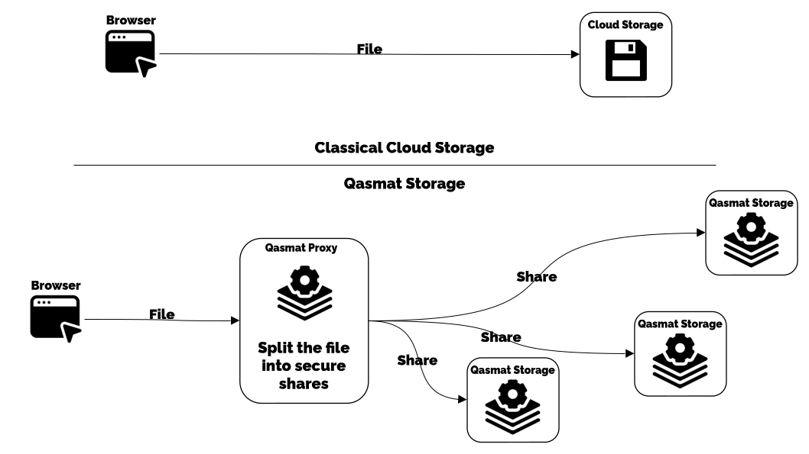

# Overview

Qasmat is a distributed secure storage software. The main idea is to securely split the file into shares and distribute them across a cluster of storage servers. The splitting and reconstruction processes use polynomials via Shamir's Secret Sharing to ensure the security of data at rest.

Here is an example of the steps involved in file protection, showing the different parts of **Qasmat**.

1. The file is sent from the user's browser to the reverse proxy hosting the web pages.
2. The authentication server ensures that the user is authenticated and returns the authenticated request.
3. The request is sent to the **Qasmat** proxy, which handles calculations: the splitting of the file into shares using the Shamir's Secret Sharing scheme.
4. The shares are distributed to the storage servers.
5. The storage servers store the shares, either on disk or on an S3-compatible instance.
6. Each binary stores the metadata about this protection. This data will be necessary for reconstruction later.

Once distributed, no trace of the file can be found on the proxy server, and the data stored on the storage servers are cryptographically independent of the file. This means no information can be extracted from one share alone.

