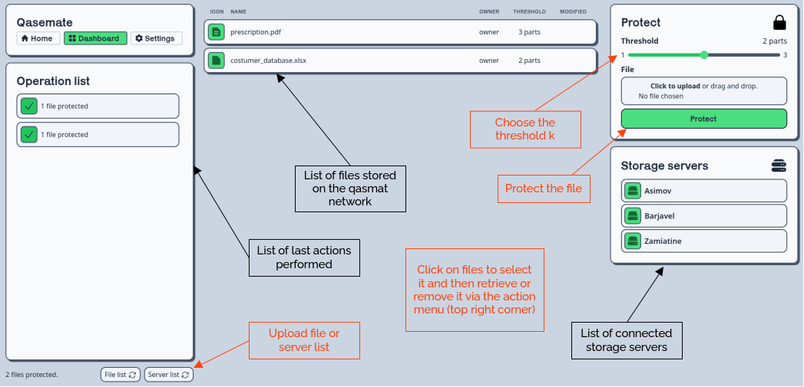

# Use Qasmat online

> ⚠️  **Warning:** Do not store files with personal information, other user might retrieve it.

A version of Qasmat is deployed on our servers and can be used to test the software. The web page is accessible to this address : <!-- TODO: Add url -->

## Authentication

The access to the service is limited to authenticated users for obvious reasons of security. The version deployed on our facilities is for demonstration purpose only. Therefor false users have been registered and can be used to use the functionalities.

Here is a list of the 5 users with their credentials :
<!-- TODO: Add users -->

## The dashboard

Once authenticated, you can access the dashboard which gather information about the files, the storage servers and different buttons to manage them.

