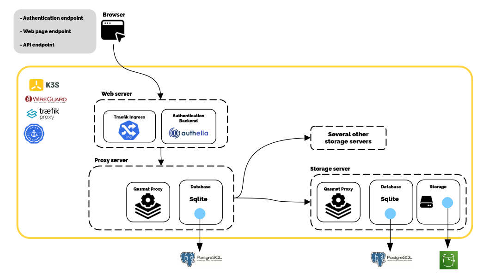

# Installation

Our software consists of different elements:
- **A proxy server (A)**: The binary (1) and its database (2).
- **Storage servers (B)**: The binary (3), its database (4), and its storage (5).
- **Another server (C)**: The reverse proxy (6) and the authentication service (7).

All these elements are contained in Docker containers and managed through a Kubernetes distribution: [K3S](https://k3s.io/). Additionally, the steps are simplified using Ansible scripts to manage configurations and ensure correct networking.

This section describes the different ways to deploy a **Qasmat** network on your infrastructure or on a cloud provider.
