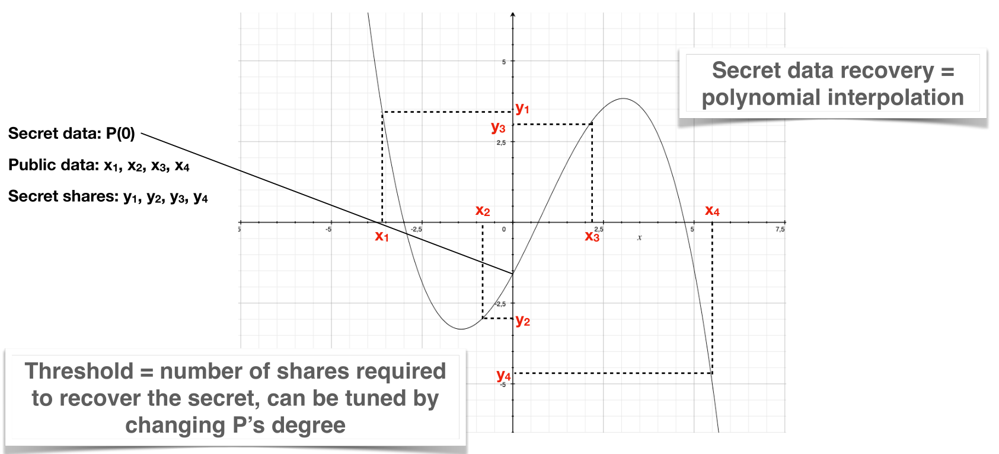

# The math behind

Imagine having to draw a line passing through one point, there is an infinity of possibilities for that line. However, if two distinct points are required, one and only one line is now possible. This very simple idea is at the heart of Shamir's secret sharing and Lagrange's interpolation around which Qasmat is built. 

The line is replaced by a polynomial of degree *k-1* whose value in zero is the secret to protect and other coefficients are chosen randomly. Then at least *k* distinct points of this polynomial are distributed on distant servers.

To recover the secret, at least *k* points of the polynomial are retrieved from different servers and the polynomial is built with Lagrange's interpolation ([visualization here](https://jsxgraph.uni-bayreuth.de/wiki/index.php/Lagrange_interpolation)). Finally, *P(0)* is calculated which correspond to the secret.

The number of points distributed (*n*) must be greater than *k*. Both values constitute a threshold *(k,n)* whose value is determined according to the security required (see [Security at rest](../security/at_rest.md)).

Last thing : because coefficients are integer, everything is modular. The modulus is a prime number which avoid some [basic attacks](https://en.wikipedia.org/wiki/Shamir's_secret_sharing#Problem_of_using_integer_arithmetic).
