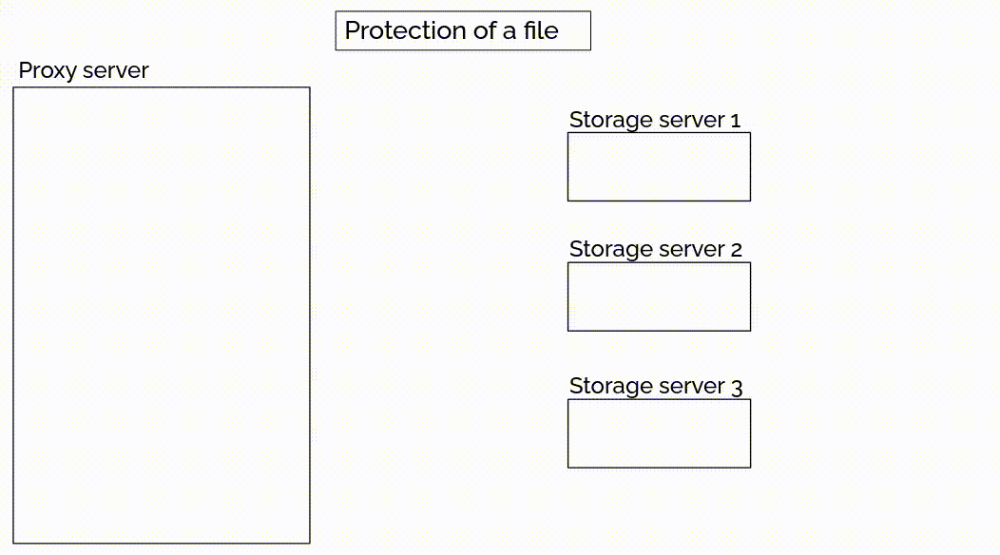
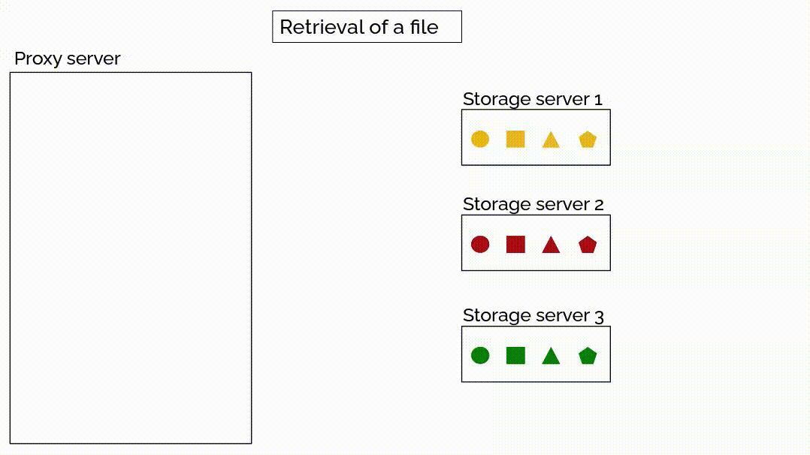

# A File Journey

First, the file is sent from the user's browser to the proxy server via HTTP/HTTPS. Due to the modulus used in all calculations, the file is split into chunks smaller than the modulus, referred to as parts.

Each part undergoes Shamir's Secret Sharing, creating \( n \) shares. Once enough shares are ready to be sent to a specific storage server, the communication module triggers a request-response exchange with that server.

Once all parts have been processed, a description of the file containing all the necessary information is stored on the proxy server.

## Protection of a File (GIF)

## Retrieval of a File (GIF)

---
