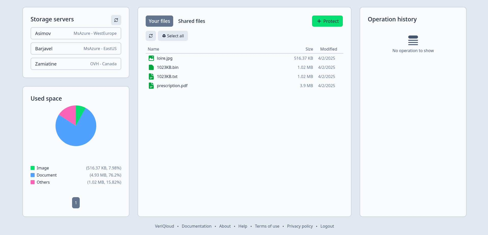

# Web Client

The graphical interface is divided into several sections.

**Storage Servers:** Lists the different storage servers available.

**Used Space:** A pie chart displaying the distribution of used space.

**Your Files:** Lists files that are stored including file names, sizes, and modification dates.

**Operation History:** Logs recent file operations performed by the user.

**Footer:** Links to "Documentation," "About," and "Help," providing additional resources or support for users. "Help" opens a tutorial popup that describes the commands and buttons.
